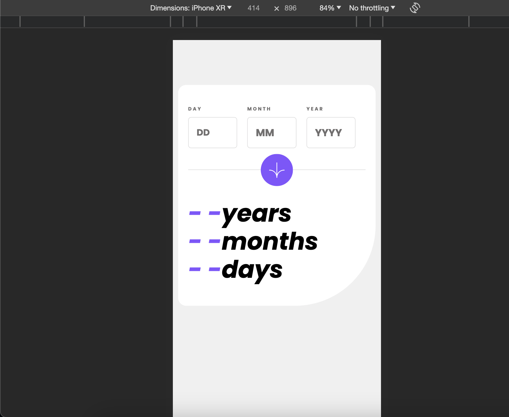

# Frontend Mentor - Age calculator app

## Hey 👋, I'm Divya. This is my solution for this challenge.

Thanks for checking out this front-end coding challenge solution.

## Built with

### Built with

- Semantic HTML5 markup
- CSS custom properties
- Flexbox
- CSS Grid
- Mobile-first workflow
- TailwindCSS

## Features

1. Responsive
2. Form validation

### Links

- Solution URL: [https://divyab28.github.io/age_calculator_app/]
- Live Site URL: [https://github.com/DivyaB28/age_calculator_app]

### Useful resources

Tailwind CSS getting started I watched this -> https://youtu.be/Ksn1tThNTjI?si=pPkoyTJ2DcQ45oA3
It helped me to start writing since i knew basic css.

I used prettier plugin for tailwind styles,
https://www.npmjs.com/package/prettier-plugin-tailwindcss

and ofcourse Tailwind Css official website https://tailwindcss.com/
