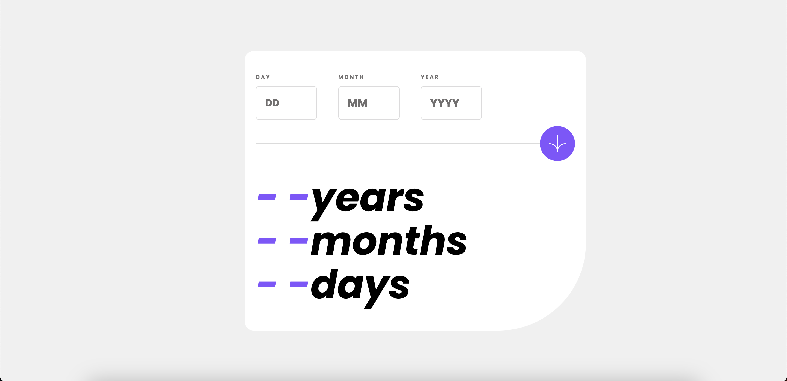

# Frontend Mentor - Age calculator app

## Hey 👋, I'm Divya. This is my solution for this challenge.

Thanks for checking out this front-end coding challenge solution.

## Built with

1. TailwindCSS
2. npm - prettier

## Features

1. Responsive
2. Form validation

Live URL -

Solution Link -
